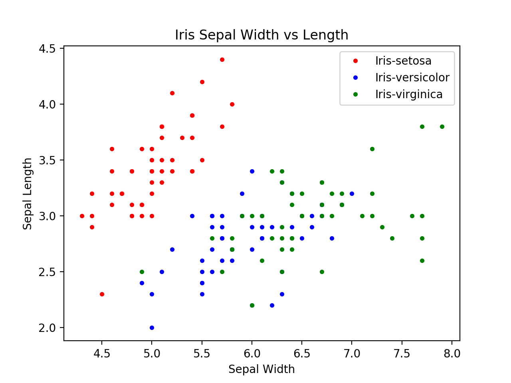
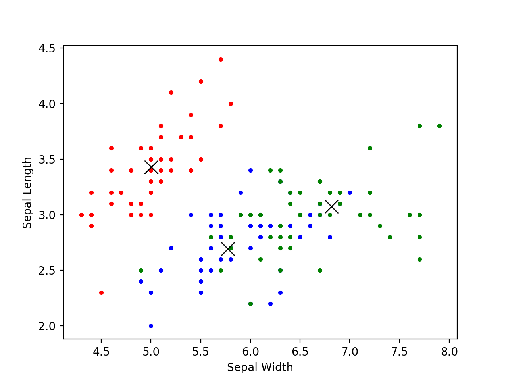
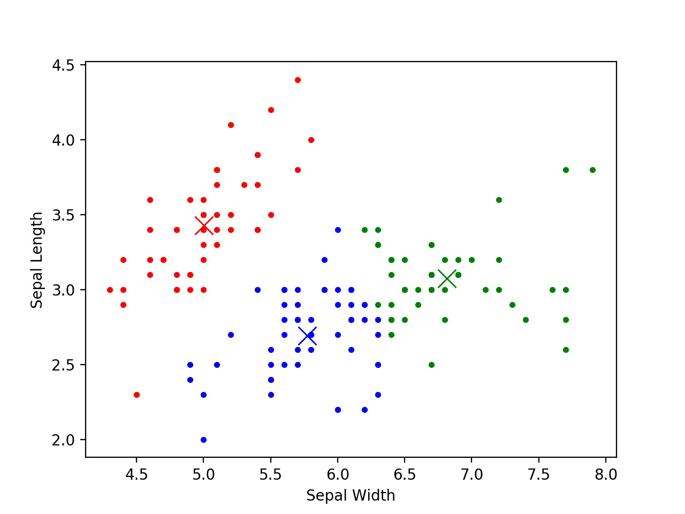

# iris-clustering

Clusters iris flowers using K-means, based on the relation of their sepal width to sepal length. Data was pulled from [UC Irvine's Iris Dataset](https://archive.ics.uci.edu/ml/datasets/iris).

## Visualizing the Data

Graphing each iris by their sepal length and sepal width, we can see how the actual clusters are related. Iris-setosa are linearly separable from the other two classes. Iris-virginica and Iris-versicolor, however, are not linearly separable, although there is a noticeable difference in where they are centered

## K-means Clustering

I implemented a K-means clustering algorithm. Based off our original data, it's clear that we should use 3 clusters. They were selected randomly to have the same coordinates as 3 of our original data points. Here are graphs from a sample run of the clustering.

| Clusters with Original Classes             |      Data with Cluster Classes  |
|:-------------------------:|:-------------------------:|
|   |     |

Kmeans was able to perfectly separate the iris-setosa, but not the iris-virginica and iris-versicolor. However, it clustered them fairly well.
